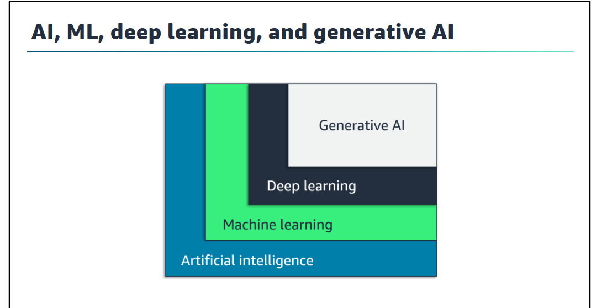
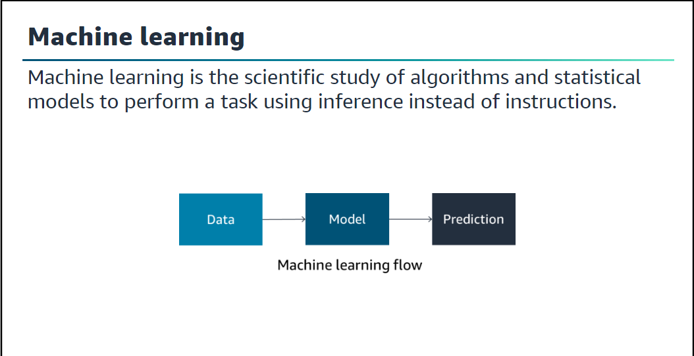

## Introduction : 

La notion dites d'intelligences artificiels est née dans les années 1950 comme l'ensemble des théories et des techniques mises en œuvre en vue de réaliser des machines capables de simuler l'intelligences.

On peut résumer `l'intelligences` à la notion `d'action cognitive`. Cela signifie que l'on peut considérer comme d'intelligences artificiel toutes machines reproduisant une `action cognitive` comme par exemple, une calculatrice qui donne le résultat 36 lorsque l'on lui demande combien font 6x6 peut être considéré comme de `IA`.
On peut considéré l'ensemble de l'informatique comme de IA, malgré tout lorsque que l'on entend parler d'IA ce n'est pas forcément à cela que l'on pense. 

La raison à cela est que nous réduisons notre idée d'IA à une machine apprenante, c'est à dire le domaine de l'algorithmie qui ne vise plus à traduire des règles de gestions fonctionnelles en chaînes de `Si/Alors/Sinon`
mais plutôt qui permet à la machine de se faire ses propres règles de gestion en observant une grande quantité de donnée représentant ce qu'on souhaite lui faire faire par la suite.

L'IA ce base sur un système neuronales permettant la simulation ou presque du cerveau humain. malgrès tout cette dernière n'est pas encore parfaite et ne peut réalisé pour le moment tout ce que l'on peu imaginer après avoir regarder un film de science fiction. 

Il existe une distinction entre l'IA actuelle, qui est limitée à des tâches spécifiques (comme Siri ou des voitures autonomes), et l'**Intelligence Artificielle Générale (AGI)**, qui aurait la capacité de comprendre et d'apprendre n'importe quelle tâche humaine. Bien que l'AGI soit encore théorique, les progrès de l'IA se rapprochent de cette vision chaque année, dans des domaines comme le traitement du langage naturel, la perception et l'interaction avec l'environnement.

L'**éthique** de la création d'IA est un sujet de débat. Certaines personnes craignent l'impact potentiel sur l'emploi, ou des scénarios dystopiques inspirés par la fiction, où les IA deviennent incontrôlables.

Même si malgré tout à l'heure actuel l'IA ne peut remplacer l'homme ou prendre le contrôle du monde. 
Il vas falloir attendre encore des dizaines d'année avant que l'on voit le jour d'une IA capable de telle prouesse.

Suite à l'ia il peut découler d'autre branche qui lui sont lié notamment le Machine Learning

### Machine learning 

Le **Machine Learning (ML)** est une branche de l'IA qui utilise des modèles statistiques pour accomplir des tâches à partir de données, sans programmation explicite. Un exemple concret est la classification des emails en spam ou non-spam. Au lieu de créer des règles manuelles pour chaque cas, un modèle de machine learning est entraîné sur des exemples étiquetés (spam/non-spam) et apprend à reconnaître les schémas qui indiquent un email indésirable.

Une célèbre définition du ML par **Tom Mitchell** dit qu'un programme "apprend" s'il améliore ses performances dans une tâche donnée (T), à partir de l'expérience (E), mesurée par un critère de performance (P). Pour l'exemple du spam :

- **E** : Les emails étiquetés comme spam ou non-spam
- **T** : La tâche d'identifier les spams
- **P** : La probabilité que l'email soit bien classé comme spam.

### Deep Learning

Le **Deep Learning** est une sous-catégorie du machine learning qui imite le fonctionnement du cerveau humain à l’aide de **réseaux de neurones artificiels (ANN)**. Ces réseaux sont composés de couches de neurones artificiels, chacun recevant des entrées, transformant ces données, et produisant une sortie qui alimente les couches suivantes.

Un réseau neuronal typique comporte trois types de couches :

- **Couche d'entrée** : Reçoit les données (ex : pixels d'une image).
- **Couches cachées** : Transforment les données à travers plusieurs neurones.
- **Couche de sortie** : Produit une prédiction ou une classification (ex : reconnaissance d'une image).

Le deep learning a révolutionné l'IA grâce à sa capacité à gérer des problèmes complexes comme la vision par ordinateur ou la reconnaissance vocale. Il optimise les connexions neuronales (les **poids**) à chaque itération d’entraînement, renforçant celles qui conduisent à une bonne prédiction et diminuant celles qui échouent.

Le **deep learning** est aujourd’hui possible grâce aux avancées matérielles récentes (comme les GPU), permettant de résoudre des problèmes beaucoup plus complexes qu’auparavant.

### IA générative

L’**IA générative** est une forme d’IA qui peut créer de nouveaux contenus, comme des textes, images, vidéos, et musiques. Elle repose sur des modèles de machine learning de très grande taille, appelés **modèles fondamentaux** (_Foundation Models_). Contrairement aux modèles traditionnels qui sont conçus pour une seule tâche, un modèle fondamental peut être utilisé pour plusieurs tâches sans nécessiter de nouvel entraînement.

Des exemples concrets d’utilisation de l’IA générative incluent les **chatbots**, les **assistants virtuels**, et la **modération de contenu** dans des environnements numériques. Ces technologies sont de plus en plus employées pour améliorer l’expérience utilisateur et personnaliser les interactions.

### ### **L’utilisation de l’IA et du Machine Learning dans Amazon AWS**

**Amazon Web Services (AWS)** est une plateforme cloud offrant divers services pour le stockage, le calcul, et le machine learning. AWS permet de créer, entraîner et déployer des modèles de machine learning à grande échelle grâce à une infrastructure performante et des outils spécialisés.

#### **Composants d’AWS pour le Machine Learning :**

1. **Amazon SageMaker** : Outil complet qui permet de construire, entraîner et déployer des modèles de machine learning rapidement. Il offre des environnements de développement intégrés (Jupyter notebooks), des outils pour l'étiquetage des données, ainsi que des algorithmes optimisés pour l'entraînement rapide sur le cloud.
    
    - **Fonctionnalités** :
        - **SageMaker Studio** : Environnement complet pour le développement de modèles.
        - **SageMaker Autopilot** : Crée automatiquement des modèles de machine learning sans avoir besoin de comprendre en détail les algorithmes.
        - **SageMaker Ground Truth** : Outil pour créer et gérer des données annotées pour l'entraînement.
2. **AWS Lambda** : Un service de calcul sans serveur qui permet d'exécuter du code en réponse à des événements sans avoir besoin de gérer des serveurs. Il peut être utilisé pour exécuter des inférences sur des modèles ML dans des environnements flexibles et économiquement optimisés.
    
3. **Amazon Rekognition** : Service qui utilise le machine learning pour analyser des images et des vidéos. Il permet la détection d’objets, de visages, d’activités, et peut être utilisé pour des tâches comme la reconnaissance faciale ou la modération de contenu.
    
4. **Amazon Polly** : Un service de synthèse vocale qui utilise des techniques de deep learning pour convertir du texte en discours naturel. C’est utile pour les applications de génération de voix, comme les assistants vocaux.
    
5. **Amazon Lex** : Service pour construire des interfaces conversationnelles (chatbots). Il permet de créer des chatbots et des assistants virtuels capables de comprendre la parole et le texte grâce à des algorithmes de traitement du langage naturel.
    
6. **AWS Deep Learning AMIs** : Images machines prêtes à l'emploi qui incluent tous les frameworks populaires de deep learning comme TensorFlow, PyTorch, et Apache MXNet. Cela permet de créer rapidement des environnements pour l’entraînement et l'inférence de modèles complexes.
    
7. **Amazon Comprehend** : Service d’analyse de texte basé sur le machine learning. Il peut détecter des entités clés, des sentiments, des catégories, et des relations dans des documents textuels.

### **Types d’Apprentissage pour Entraîner une IA**

Pour entraîner une IA, il existe plusieurs approches basées sur la manière dont les données sont utilisées et les types de signaux de retour disponibles pour l'algorithme.

#### **1. Apprentissage supervisé**

Dans l'**apprentissage supervisé**, on entraîne un modèle avec des **données étiquetées**. Cela signifie que chaque exemple dans le jeu de données d'entraînement est associé à une réponse correcte. L'objectif est d'apprendre une fonction qui mappe les entrées aux sorties correctes.

- **Principe** :
    
    - On fournit à l'algorithme un ensemble de données d'entraînement contenant des paires d’entrées et de sorties correctes.
    - L’algorithme ajuste ses paramètres internes pour minimiser la différence entre les prédictions et les sorties attendues.
    - Une fois entraîné, le modèle est capable de prédire des sorties pour des nouvelles données qui ne lui ont pas été présentées auparavant.
- **Exemples de tâches supervisées** :
    
    - **Classification** : Catégoriser des e-mails en "spam" ou "non spam".
    - **Régression** : Prédire le prix d'une maison en fonction de ses caractéristiques (taille, emplacement, etc.).
- **Algorithmes courants** :
    
    - **Régression linéaire** : Pour prédire une valeur continue.
    - **Forêt aléatoire (Random Forest)** : Utilise plusieurs arbres de décision pour des tâches de classification et de régression.
    - **Réseaux de neurones** : Pour les tâches complexes comme la reconnaissance d’images.

#### **2. Apprentissage non supervisé**

L'**apprentissage non supervisé** consiste à entraîner un modèle à partir de données non étiquetées. L'objectif est de découvrir des **patterns cachés** ou des structures sous-jacentes dans les données sans connaître les réponses correctes à l'avance.

- **Principe** :
    
    - L'algorithme explore les données pour identifier des motifs, des regroupements ou des relations intéressantes.
    - Il n'y a pas de "vérité" à suivre, donc l'algorithme n'a pas de retour direct pour savoir s'il fait des erreurs ou non.
- **Exemples de tâches non supervisées** :
    
    - **Clustering (regroupement)** : Par exemple, segmenter les clients d'une entreprise en groupes en fonction de leurs comportements d’achat.
    - **Réduction de dimension** : Compresser les données tout en préservant leur structure importante (comme le fait l’algorithme PCA – Analyse en Composantes Principales).
- **Algorithmes courants** :
    
    - **K-Means** : Pour regrouper des données en K groupes.
    - **Algorithmes de réduction de dimension (PCA, t-SNE)** : Utilisés pour compresser et visualiser des données complexes.

#### **3. Apprentissage semi-supervisé**

L'**apprentissage semi-supervisé** est un compromis entre l'apprentissage supervisé et non supervisé. Ici, une petite partie des données est étiquetée, tandis que le reste des données est non étiqueté. Cela permet d’utiliser des données non étiquetées pour améliorer la performance du modèle.

- **Principe** :
    
    - On entraîne le modèle sur des données étiquetées, puis on utilise les prédictions faites sur des données non étiquetées pour affiner ou améliorer le modèle.
    - Cette approche est utile lorsque l’étiquetage des données est coûteux ou difficile.
- **Exemples d'application** :
    
    - Classer des vidéos ou images où seule une petite fraction a des étiquettes (ex : contenu pour la modération sur des plateformes en ligne).

#### **4. Apprentissage par renforcement (Reinforcement Learning)**

Dans l'**apprentissage par renforcement**, un agent apprend à interagir avec un environnement et reçoit des **récompenses** ou des **punitions** en fonction de ses actions. L’objectif est d’apprendre à maximiser la récompense cumulée au fil du temps.

- **Principe** :
    
    - Un agent prend des décisions à chaque étape en fonction de l’état actuel de l’environnement.
    - Après chaque action, il reçoit une rétroaction (positive ou négative).
    - Il ajuste ses actions futures pour obtenir la meilleure récompense possible sur le long terme.
- **Exemples d'applications** :
    
    - **Jeux** : Les agents entraînés avec l'apprentissage par renforcement, comme AlphaGo de DeepMind, ont surpassé les humains dans des jeux complexes comme le jeu de Go ou les jeux vidéo.
    - **Robotique** : Les robots apprennent à accomplir des tâches en interagissant avec leur environnement et en recevant des récompenses pour des actions correctes.
- **Algorithmes courants** :
    
    - **Q-Learning** : L'agent apprend une fonction appelée "Q" qui estime la récompense attendue pour chaque action dans un état donné.
    - **Deep Q-Networks (DQN)** : Un réseau de neurones est utilisé pour approximer la fonction Q, permettant de gérer des environnements plus complexes.